

 

&nbsp;

&nbsp;

&nbsp;

 

---

## 🧩 What is Merger?

**Merger** is a high-performance, full-stack developer collaboration platform. It bridges the gap between discovery and building, allowing developers to find partners, send **merge requests** to connect, and manage shared projects in a unified environment.

> 🚀 **Mission:** To empower developers to turn "I have an idea" into "We built this together."

---

## 🤖 AI-Powered Intelligence

Merger leverages state-of-the-art AI to streamline collaboration and project management.

  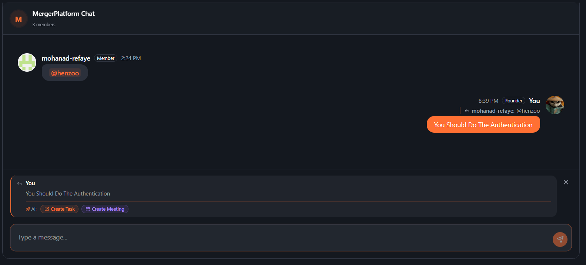
  
<i><b>Smart Chat Actions:</b> Gemini-powered context awareness. Automatically create tasks, schedule meetings, or generate summaries directly from your team chat.</i>

  
   
  
  

    

      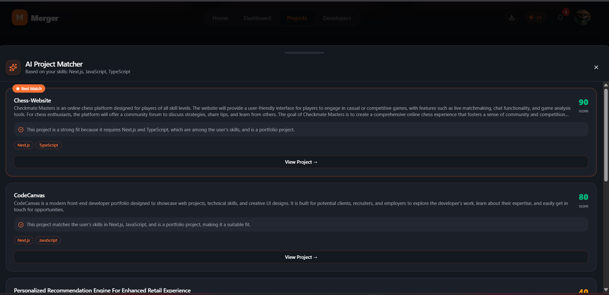
      
<i><b>Project Matcher:</b> Discover projects that perfectly align with your tech stack and interests.</i>

    

    

      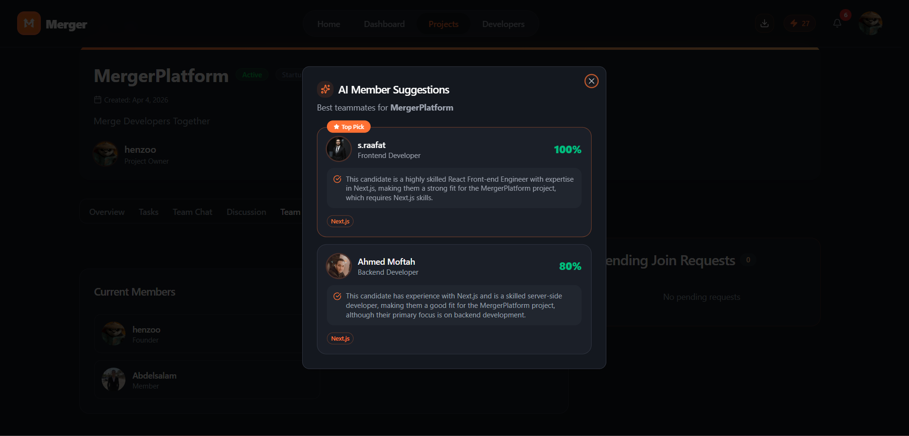
      
<i><b>Teammate Recommendations:</b> Find the missing piece for your team based on skill synergy.</i>

    

  

---

## 📸 Visual Showcase

### The Hub & Insights

  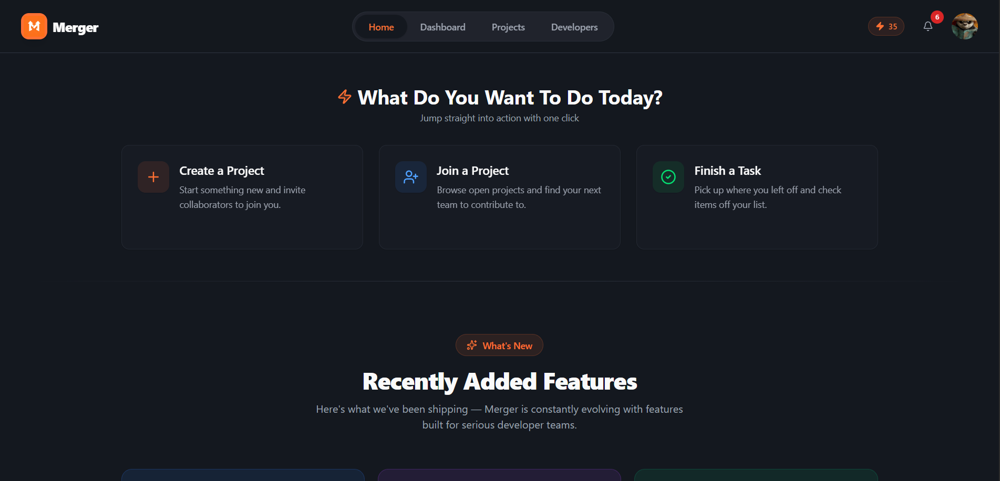
  
<i><b>Landing Hub:</b> A centralized entry point for all your collaborative activities.</i>

  
   
  
  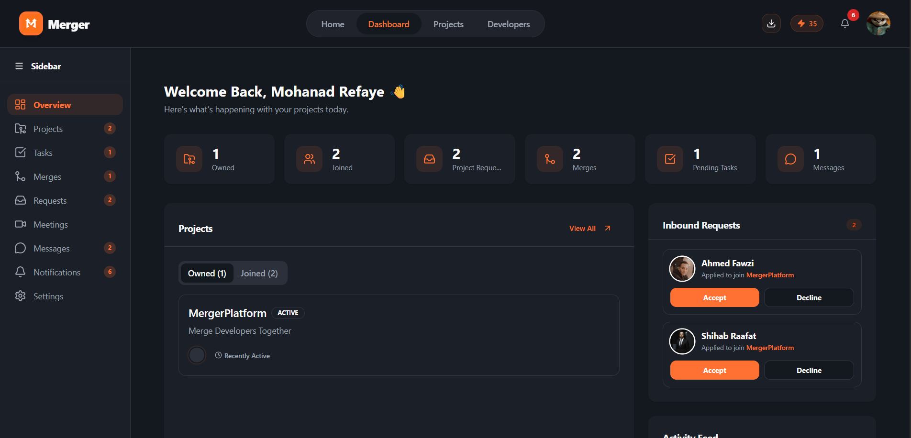
  
<i><b>Dashboard:</b> Real-time analytics, inbound request management, and project tracking.</i>

### Discovery & Networking

  

    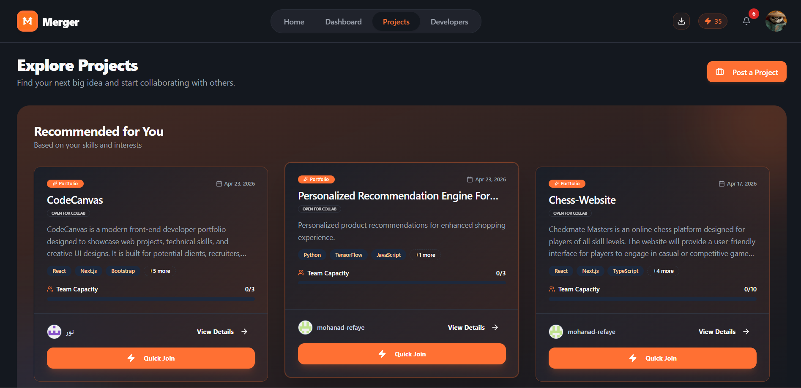
    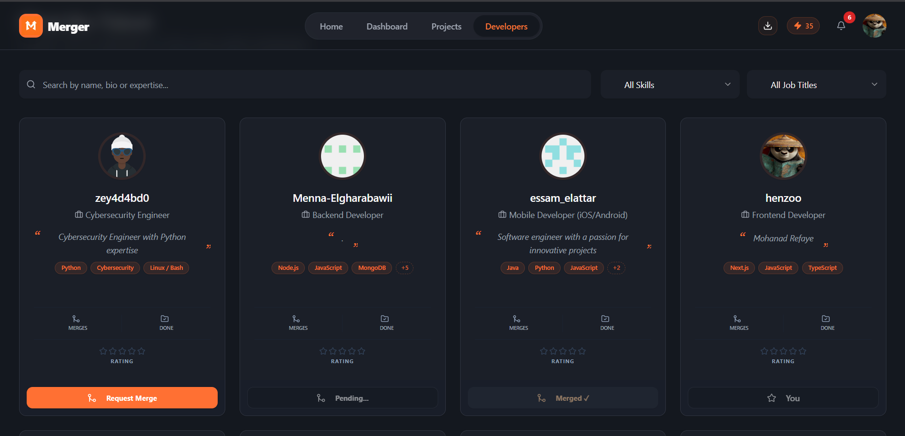
  

  
<i><b>Global Search:</b> Browse a curated list of active projects or discover talented developers.</i>

### Project Deep-Dive

  

    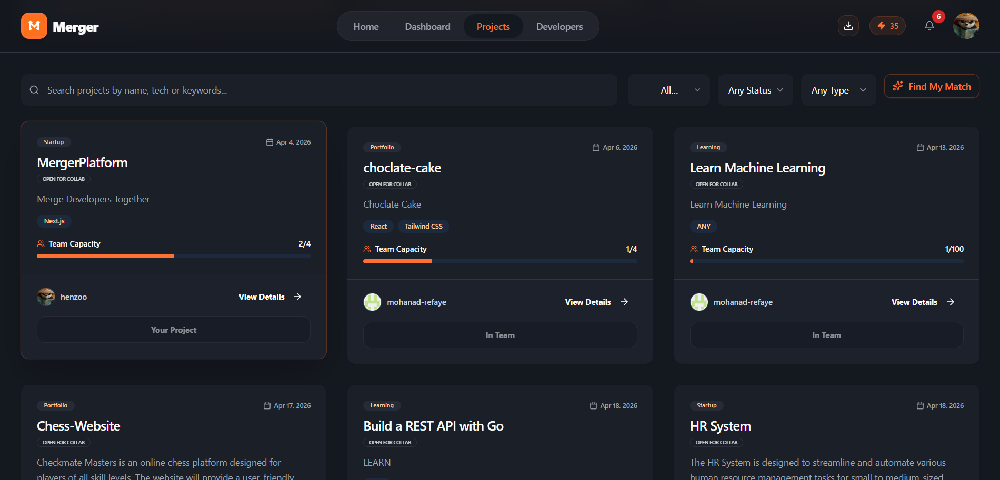
    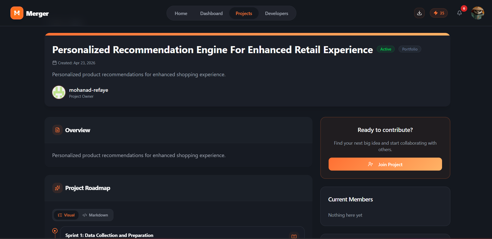
  

  
<i><b>Project Management:</b> From high-level listings to detailed project specifications and roadmaps.</i>

### Collaboration Tools

  

    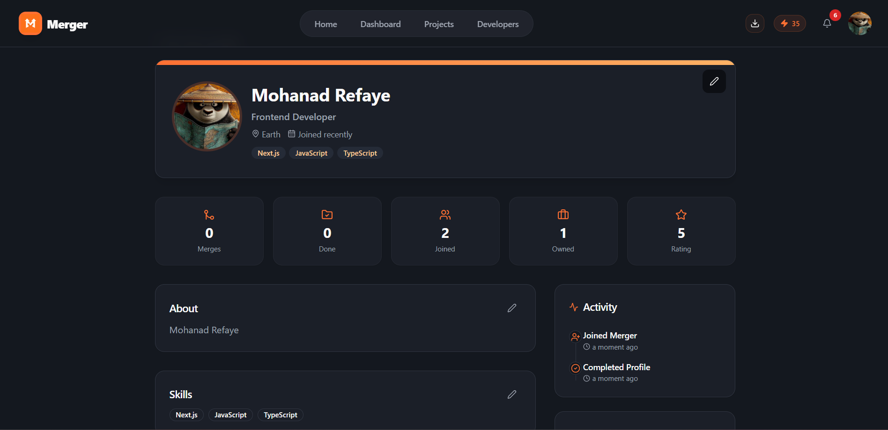
    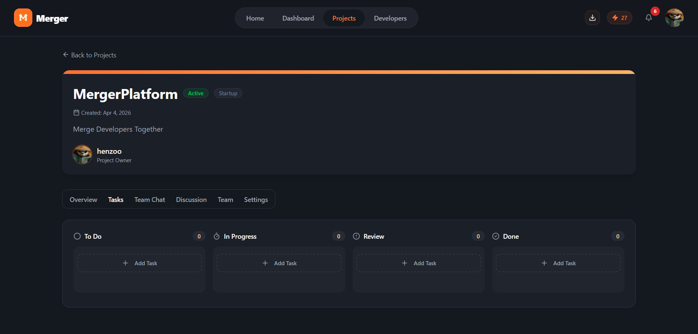
  

  
<i><b>Execution:</b> Rich developer profiles and integrated Kanban-style task boards.</i>

---

## ✨ Key Features

| Feature                 | Description                                                             |
| :---------------------- | :---------------------------------------------------------------------- |
| **👤 Rich Profiles**    | Showcase your skills, bio, and portfolio to stand out in the community. |
| **🔀 Merge Requests**   | The "Handshake for Builders" — a formal way to propose collaboration.   |
| **📁 Task Management**  | Integrated boards to keep your team aligned and productive.             |
| **💬 Real-time Chat**   | Low-latency communication powered by Ably/Firebase.                     |
| **🌍 Bilingual (i18n)** | Full English and Arabic support with seamless RTL/LTR switching.        |
| **🔔 Smart Alerts**     | Push notifications to keep you updated on the go.                       |

---

## 🛠️ Modern Tech Stack

| Layer              | Technology                                               |
| :----------------- | :------------------------------------------------------- |
| **Core**           | Next.js 16 (App Router), React 19, TypeScript 5          |
| **Design**         | Tailwind CSS 4, Framer Motion (Animations), Lucide Icons |
| **Backend**        | Server Actions, Drizzle ORM, Turso (SQLite)              |
| **Auth**           | NextAuth.js (GitHub & Google OAuth)                      |
| **AI**             | Google Gemini 1.5 Pro, Groq LPU™ Inference               |
| **Infrastructure** | Firebase (Realtime DB & FCM), Ably (Pub/Sub), Vercel     |

---

## 🚀 Experience Merger

Merger is a live platform — start building your next big thing today.

1. **Visit:** [merger.vercel.app](https://merger.vercel.app)
2. **Authenticate:** Sign in securely with GitHub or Google.
3. **Onboard:** Set up your developer profile.
4. **Merge:** Find a project or developer and start collaborating.

---

## 🛡️ Security

We prioritize the safety of our users and their data. For details on our security practices or to report a vulnerability, please see our **[Security Policy](./SECURITY.md)**.

---

## 📄 License

This project is licensed under the **MIT License** — see the [LICENSE](./LICENSE) file for details.

---

Built with ❤️ by **[Mohanad Refaye](https://github.com/enghenzoo)**

 

⭐ If you find Merger useful, give it a star — it helps more developers discover it!

